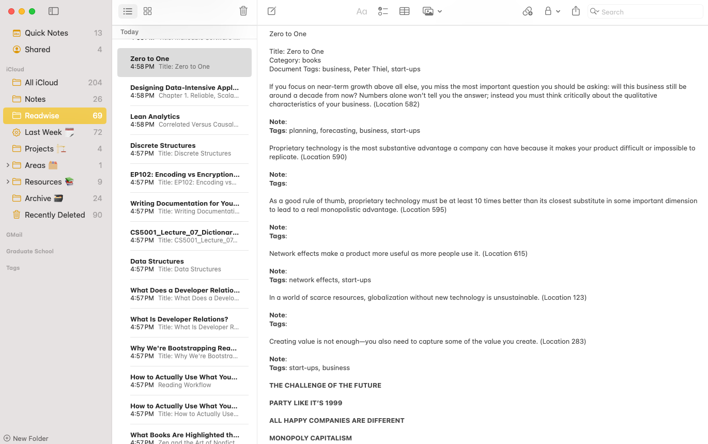

# readwise-to-apple-notes

Export Readwise highlights to Apple Notes.

## Installation

Install this tool using `uv`:

    uv add readwise-to-apple-notes

Or add install it as a tool:

    uv tool install readwise-to-apple-notes

then run:

    readwise-to-apple-notes export

## Usage

> [!IMPORTANT]
> First, obtain a Readwise access token. Then, the token has to be stored, either into an .env file or an environment variable using export READWISE_TOKEN=<your_token>.

For help, run:

    readwise-to-apple-notes --help

You can also use:

    uv run readwise-to-apple-notes --help

### Export

> [!NOTE]
> When you first run the `export` command. The script will create a new folder in your Apple Notes labeled "Readwise" if it does not exist. All highlights within a given book, article, document will be placed in the same note. See example below.

Export all highlights:

    readwise-to-apple-notes export

You should see progress bars for each document and the number of highlights to be written to a new Apple Note.

    readwise-to-apple-notes export

    Exporting highlights  [####################################]  28/28 100% 
    Exporting highlights  [####################################]  10/10  100%         
    Exporting highlights  [####################################]  21/21  100%  

Export after a specific date:

    readwise-to-apple-notes export --updated-after 2024-03-15

Export a single books highlights:

    readwise-to-apple-notes export --book-id=<user_book_id>

Or a list of books:

    readwise-to-apple-notes export --book-id=<user_book_id>,<another_book_id>

### Additional Commands

When you need to look up a`book_id`, run:

    readwise-to-apple-notes books
    
    {
        "id": 29932193,
        "title": "Thinking, Fast and Slow",
        "author": "Daniel Kahneman",
        "category": "books",
        "num_highlights": 2,
        "source": "kindle",
        "document_note": "",
        "document_tag": ""
    }
    ...
    {
        "id": 29931089,
        "title": "How to Use Readwise",
        "author": "Readwise Team",
        "category": "books",
        "num_highlights": 62,
        "source": "native",
        "document_note": "",
        "document_tag": "readwise"
    }

If you know the `book_id` and want to check a book's details, run:

    readwise-to-apple-notes book 29932193

    {
        "id": 29932193,
        "title": "Thinking, Fast and Slow",
        "author": "Daniel Kahneman",
        "category": "books",
        "source": "kindle",
        "num_highlights": 2,
        "last_highlight_at": "2016-08-03T04:56:00.000000Z",
        "updated": "2023-07-10T00:56:27.463529Z",
        "cover_image_url": "https://images-na.ssl-images-amazon.com/images/I/41shZGS-G%2BL._SL200_.jpg",
        "highlights_url": "https://readwise.io/bookreview/29932193",
        "source_url": null,
        "asin": "B00555X8OA",
        "tags": [],
        "document_note": ""
    }

### API Reference

    Usage: readwise-to-apple-notes [OPTIONS] COMMAND [ARGS]...

    Export Readwise Highlights to Apple Notes.

    Options:
    --version  Show the version and exit.
    --help     Show this message and exit.

    Commands:
    book
    books
    export

## Development

To contribute to this tool, first checkout the code. Then run `uv sync`:

    cd readwise-to-apple-notes
    uv sync

Now install the dependencies and test dependencies:

    uv sync --group dev

To run the tests:

    uv run pytest
